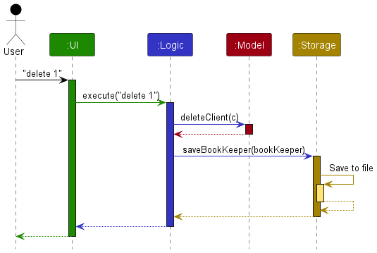
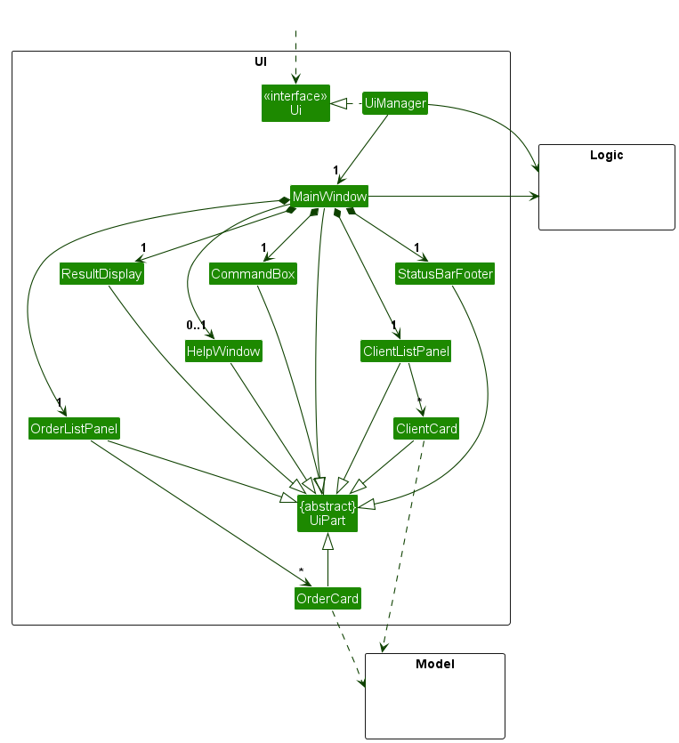
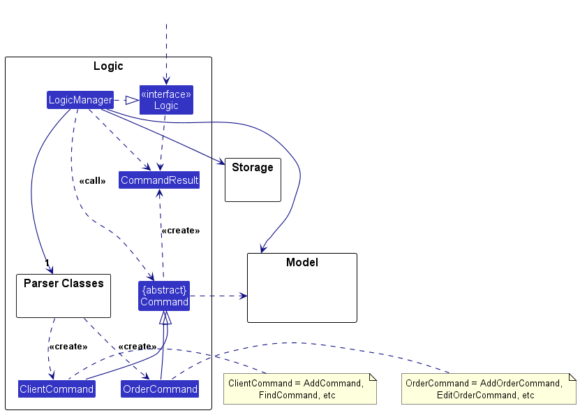
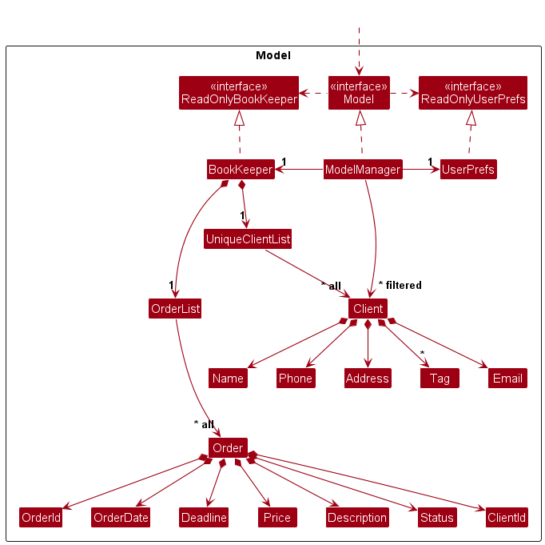
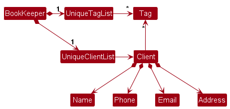
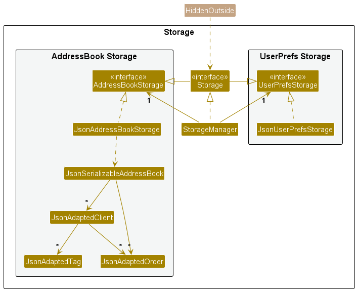
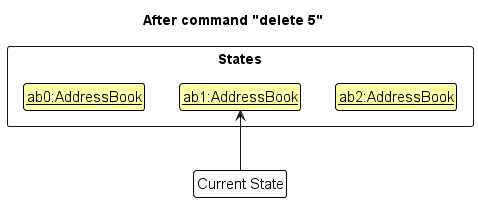

* Table of Contents
  {:toc}

--------------------------------------------------------------------------------------------------------------------

## **Acknowledgements**

* [AB3 developer guide](https://nus-cs2103-ay2324s2.github.io/tp/DeveloperGuide.html) for the initial template
  and structure of this document.

--------------------------------------------------------------------------------------------------------------------

## **Setting up, getting started**

Refer to the guide [_Setting up and getting started_](SettingUp.md).

--------------------------------------------------------------------------------------------------------------------

## **Design**

:bulb: **Tip:** The `.puml` files used to create diagrams in this document `docs/diagrams` folder. Refer to the [
_PlantUML Tutorial_ at se-edu/guides](https://se-education.org/guides/tutorials/plantUml.html) to learn how to create
and edit diagrams.

### Architecture

The ***Architecture Diagram*** given above explains the high-level design of the App.

Given below is a quick overview of main components and how they interact with each other.

**Main components of the architecture**

**`Main`** (consisting of
classes [`Main`](https://github.com/AY2324S2-CS2103T-T09-2/tp/blob/master/src/main/java/seedu/address/Main.java)
and [`MainApp`](https://github.com/AY2324S2-CS2103T-T09-2/tp/blob/master/src/main/java/seedu/address/MainApp.java)) is
in charge of the app launch and shut down.

* At app launch, it initializes the other components in the correct sequence, and connects them up with each other.
* At shut down, it shuts down the other components and invokes cleanup methods where necessary.

The bulk of the app's work is done by the following four components:

* [**`UI`**](#ui-component): The UI of the App.
* [**`Logic`**](#logic-component): The command executor.
* [**`Model`**](#model-component): Holds the data of the App in memory.
* [**`Storage`**](#storage-component): Reads data from, and writes data to, the hard disk.

[**`Commons`**](#common-classes) represents a collection of classes used by multiple other components.

**How the architecture components interact with each other**

The *Sequence Diagram* below shows how the components interact with each other for the scenario where the user issues
the command `delete 1`.

Each of the four main components (also shown in the diagram above),

* defines its *API* in an `interface` with the same name as the Component.
* implements its functionality using a concrete `{Component Name}Manager` class (which follows the corresponding
  API `interface` mentioned in the previous point).

For example, the `Logic` component defines its API in the `Logic.java` interface and implements its functionality using
the `LogicManager.java` class which follows the `Logic` interface. Other components interact with a given component
through its interface rather than the concrete class (reason: to prevent outside component's being coupled to the
implementation of a component), as illustrated in the (partial) class diagram below.

The sections below give more details of each component.

### UI component

The **API** of this component is specified
in [`Ui.java`](https://github.com/AY2324S2-CS2103T-T09-2/tp/blob/master/src/main/java/seedu/address/ui/Ui.java)

The UI consists of a `MainWindow` that is made up of parts
e.g.`CommandBox`, `ResultDisplay`, `ClientListPanel`, `StatusBarFooter` etc. All these, including the `MainWindow`,
inherit from the abstract `UiPart` class which captures the commonalities between classes that represent parts of the
visible GUI.

The `UI` component uses the JavaFx UI framework. The layout of these UI parts are defined in matching `.fxml` files that
are in the `src/main/resources/view` folder. For example, the layout of
the [`MainWindow`](https://github.com/AY2324S2-CS2103T-T09-2/tp/blob/master/src/main/java/seedu/address/ui/MainWindow.java)
is specified
in [`MainWindow.fxml`](https://github.com/AY2324S2-CS2103T-T09-2/tp/blob/master/src/main/resources/view/MainWindow.fxml)

The `UI` component,

* executes user commands using the `Logic` component.
* listens for changes to `Model` data so that the UI can be updated with the modified data.
* keeps a reference to the `Logic` component, because the `UI` relies on the `Logic` to execute commands.
* depends on some classes in the `Model` component, as it displays `Client` object residing in the `Model`.

### Logic component

**API
** : [`Logic.java`](https://github.com/AY2324S2-CS2103T-T09-2/tp/blob/master/src/main/java/seedu/address/logic/Logic.java)

Here's a (partial) class diagram of the `Logic` component:

The sequence diagram below illustrates the interactions within the `Logic` component, taking `execute("delete 1")` API
call as an example.

:information_source: **Note:** The lifeline for `DeleteCommandParser` should end at the destroy marker (X) but due to a limitation of PlantUML, the lifeline continues till the end of diagram.

How the `Logic` component works:

1. When `Logic` is invoked to execute a command, it delegates the command to an `BookKeeperParser` object. This object
   then
   creates a parser corresponding to the command type (e.g., `DeleteCommandParser`) and utilizes it to interpret the
   command.
2. This process generates a `Command` object (to be more specific, an instance of one of its subclasses, e.g.,
   DeleteCommand) which is then executed by the `LogicManager`.
3. During execution, the command can interact with the `Model` (e.g., to delete a `Client` or manage `Order`
   details). 
   While this interaction is depicted as a singular step in the above diagram for the sake of simplicity, the actual
   implementation may involve multiple interactions (between the command object and the `Model`) to accomplish the
   intended task.
4. The outcome of the command's execution is encapsulated within a `CommandResult` object, which is then returned from
   `Logic`. Additional classes in `Logic` (not shown in the class diagram above) that are utilized for parsing a user
   command:

### Model component

**API
** : [`Model.java`](https://github.com/AY2324S2-CS2103T-T09-2/tp/blob/master/src/main/java/seedu/address/model/Model.java)

The `Model` component,

* stores bookkeeper data i.e., all `Client` objects (which are contained in a `UniqueClientList` object).
* stores the currently 'selected' `Client` objects (e.g., results of a search query) as a separate _filtered_ list which
  is exposed to outsiders as an unmodifiable `ObservableList<Client>` that can be 'observed' e.g. the UI can be bound to
  this list so that the UI automatically updates when the data in the list change.
* stores the currently 'selected' `Order` objects (e.g., results of a search query) as a separate _filtered_ list which
  is exposed to outsiders as an unmodifiable `ObservableList<Order>` that can be 'observed' e.g. the UI can be bound to
  this list so that the UI automatically updates when the data in the list change.
* stores a `UserPref` object that represents the user’s preferences. This is exposed to the outside as
  a `ReadOnlyUserPref` objects.
* does not depend on any of the other three components (as the `Model` represents data entities of the domain, they
  should make sense on their own without depending on other components)

:information_source: **Note:** An alternative (arguably, a more OOP) model is given below. It has a `Tag` list in the `BookKeeper`, which `Client` references. This allows `BookKeeper` to only require one `Tag` object per unique tag, instead of each `Client` needing their own `Tag` objects. 

### Storage component

**API
** : [`Storage.java`](https://github.com/AY2324S2-CS2103T-T09-2/tp/blob/master/src/main/java/seedu/address/storage/Storage.java)

Below is an updated UML class diagram illustrating the relationships and interactions among the various storage-related
classes:

The `Storage` component of our application is responsible for handling the reading and writing of data to and from
external storage sources.
This includes functionalities such as saving and retrieving bookkeeper data and user preferences.
In this section, we will delve into the recent enhancements made to the `Storage` component, focusing on the
implementation of storing clients and order details.

In this enhancement, the `Storage` component has been extended to support the storage and retrieval of both client and
order details.
Previously, the `Storage` component was primarily designed to handle bookkeeper data and user preferences. However,
with the growing requirements of our application, it becomes necessary to accommodate the storage of clients and orders.

--------------------------------------------------------------------------------------------------------------------

### Common classes

Classes used by multiple components are in the `seedu.address.commons` package.

--------------------------------------------------------------------------------------------------------------------

## **Implementation**

This section describes some noteworthy details on how certain features are implemented.

### Adding the Order methods

#### Command and CommandParser Implementations

To implement the new Order Logic, a new package has to be created within the commands and parser packages to cater to
the order implementations. The key changes would be:

- Creation of new classes:
    - Created a `AddOrderCommand` class to cater to order creation inputs by the user. This will get the
      referenced `Client` by their index in the `ObservableList` and check if the `Client` index is valid.
      Afterwards, it will create & append the `Order` object into the `Client` object's respective orders list.
      Upon execution of this command, it will return the `CommandResult` on for the output box to indicate if it was a
      successful command or not.
    - Created a `DeleteOrderCommand` class to cater to delete orders by their index in their `ObservableList` class.
      This will allow the users to delete by index instead of the UUID. The `DeleteOrderCommand` first checks
      the `ObservableList` by index to determine if the `Order` index is valid, then checks which `Client` the `Order`
      object belongs to. This allows the modification of both `Client`s and `Order`s at the same time.
      Upon execution of this command, it will return the `CommandResult` on for the output box to indicate if it was a
      successful command or not.

    - Created a `EditOrderCommand` class to cater to allow editing Orders by the user. It will first search the `Order`
      objects in the `ObservableList` to ensure that the index is valid, before finding the `Client` object that
      the `Order` object belongs to.
      Afterwards, the `Order` object is edited, and will be replaced in the `Client` object's orders list to update the
      details. This will be encapsulated and returned in a `Command` object that will be executed in the main logic.
- Creation of new parser classes:
    - Creating a `AddOrderCommandParser` class to create the respective `Command` object by parsing the user input. This
      flow is as intended, and will allow us to get index of the `Client` object in the `ObservableList` and get the
      required parameters typed by the user by parsing it with
      the `Prefix` objects in `CliSyntax` class.
      For this command, the prefixes used would be `d/` for description, `c/` for price and `by/` for the deadline.
      The respective `AddOrderCommand` will be created to be executed by the `LogicManager`.
    - Creating a `DeleteOrderCommandParser` class to create the respective `Command` object by parsing the user input.
      This flow is as intended, and will allow us to get index of the Order object in the `ObservableList`.
      This will create the respective `DeleteOrderCommand` to be executed by the `LogicManager`.
    - Creating a `EditOrderCommandParser` class to create the respective `Command` object by parsing the user input.
      This flow is as intended, and will allow us to get index of the Order object in the `ObservableList` and get the
      required parameters typed by the user by parsing it with
      the `Prefix` objects in `CliSyntax` class. For this command, the prefixes used would be `d/` for description, `c/`
      for price and `by/` for the deadline.
      These prefixes are optional, and not including them will use the current `Order` object details.
      At the end this will create the respective `EditOrderCommand` to be executed by the `LogicManager`.

- Update `Model` and `ModelManager` to provide methods to support the new classes. such as creating the
  new `ObservableList` object for `Order` objects to
  update the JavaFX element in the UI.

#### Why is it implemented this way:

It was done in this manner to adhere to the following design principles:

- Separation of Concerns: By delegating specific responsibilities to specialized classes (like `BookKeeperParser`,
  `AddOrderCommandParser`, etc.), the design adheres to the principle of separation of concerns. This means each part of
  the system has a clear responsibility, reducing complexity and making the codebase easier to understand and maintain.
- Provide Extensibility: With a modular structure, adding new functionality (like future order implementations)
  involves creating new classes and modifying existing ones minimally. This approach makes the system more extensible,
  as seen with the introduction of new parser and command classes for handling orders.
- Enhances Frontend Integration:  By redefining how the `ObservableList` is managed within the `ModelManager` for
  Orders, we enhance our capability to directly manipulate the `OrderList` view in JavaFX. This adjustment in the
  ModelManager class creates a seamless and responsive interaction between the backend data structures and the frontend
  user interface.

By doing so, am able to emphasize on the clear separation of duties among components and allowing flexibility to add
new features with minimal disruption This strategy not only facilitates easier maintenance and scalability but also
enhances our future ability to develop and create requirements or changes in functionality without affecting much of the
codebase.

How the parsing works:

* When called upon to parse a user command, the `BookKeeperParser` class creates an `XYZCommandParser` (`XYZ` is a
  placeholder for the specific command name e.g., `AddCommandParser`) which uses the other classes shown above to parse
  the user command and create a `XYZCommand` object (e.g., `AddCommand`) which the `BookKeeperParser` returns back as
  a `Command` object.
* All `XYZCommandParser` classes (e.g., `AddCommandParser`, `DeleteCommandParser`, ...) inherit from the `Parser`
  interface so that they can be treated similarly where possible e.g, during testing.

#### Storage Implementations

To implement this feature, several modifications were made across different classes within the `Storage` package. The
key changes include:

1. New Classes: The introduction of `JsonAdaptedClient` and `JsonAdaptedOrder` classes to facilitate the conversion
   between JSON format and the corresponding model objects (`Client` and `Order`).

2. Updated Interfaces: The `BookKeeperStorage` interface was extended to included methods for reading and writing
   orders. Similarly, the `Storage` interface, which serves as an umbrella for all storage-related functionalities,
   was update to incorporate these changes.

3. Storage Manager: The `StorageManager` class, which orchestrates the storage operations, was modified to delegate the
   handling of client and order data to the appropriate storage classes.

4. Unit Tests: Unit tests were added or updated to ensure the correctness and robustness of the new functionalities.

#### Why it is implemented that way:

With the implementation of storing clients and orders details, the `Storage` component of our application has been
enhanced to better meet the evolving needs of our users. These changes not only improve the functionality of our
application but also lay the groundwork for future enhancements and features.

Future plans may involve further optimizing the storage mechanisms, exploring alternative storage formats, or
integrating additional data validation checks to ensure data integrity. Overall, the recent enhancements to
the `Storage` component
mark a significant step forward in enhancing the robustness and flexibility of our application.

### \[Proposed\] Undo/redo feature

#### Proposed Implementation

The proposed undo/redo mechanism is facilitated by `VersionedBookKeeper`. It extends `BookKeeper` with an undo/redo
history, stored internally as an `addressBookStateList` and `currentStatePointer`. Additionally, it implements the
following operations:

* `VersionedBookKeeper#commit()`— Saves the current bookkeeper state in its history.
* `VersionedBookKeeper#undo()`— Restores the previous bookkeeper state from its history.
* `VersionedBookKeeper#redo()`— Restores a previously undone bookkeeper state from its history.

These operations are exposed in the `Model` interface as `Model#commitBookKeeper()`, `Model#undoBookKeeper()`
and `Model#redoBookKeeper()` respectively.

Given below is an example usage scenario and how the undo/redo mechanism behaves at each step.

Step 1. The user launches the application for the first time. The `VersionedBookKeeper` will be initialized with the
initial bookkeeper state, and the `currentStatePointer` pointing to that single bookkeeper state.

Step 2. The user executes `delete 5` command to delete the 5th client in bookkeeper. The `delete` command
calls `Model#commitBookKeeper()`, causing the modified state of bookkeeper after the `delete 5` command executes
to be saved in the `addressBookStateList`, and the `currentStatePointer` is shifted to the newly inserted bookkeeper
state.

Step 3. The user executes `add n/David …​` to add a new client. The `add` command also
calls `Model#commitBookKeeper()`, causing another modified bookkeeper state to be saved into
the `addressBookStateList`.

:information_source: **Note:** If a command fails its execution, it will not call `Model#commitBookKeeper()`, so bookkeeper state will not be saved into the `addressBookStateList`.

Step 4. The user now decides that adding the client was a mistake, and decides to undo that action by executing
the `undo` command. The `undo` command will call `Model#undoBookKeeper()`, which will shift the `currentStatePointer`
once to the left, pointing it to the previous bookkeeper state, and restores bookkeeper to that state.

:information_source: **Note:** If the `currentStatePointer` is at index 0, pointing to the initial BookKeeper state, then there are no previous BookKeeper states to restore. The `undo` command uses `Model#canUndoBookKeeper()` to check if this is the case. If so, it will return an error to the user rather
than attempting to perform the undo.

The following sequence diagram shows how an undo operation goes through the `Logic` component:

:information_source: **Note:** The lifeline for `UndoCommand` should end at the destroy marker (X) but due to a limitation of PlantUML, the lifeline reaches the end of diagram.

Similarly, how an undo operation goes through the `Model` component is shown below:

The `redo` command does the opposite — it calls `Model#redoBookKeeper()`, which shifts the `currentStatePointer` once
to the right, pointing to the previously undone state, and restores bookkeeper to that state.

:information_source: **Note:** If the `currentStatePointer` is at index `addressBookStateList.size() - 1`, pointing to the latest bookkeeper state, then there are no undone BookKeeper states to restore. The `redo` command uses `Model#canRedoBookKeeper()` to check if this is the case. If so, it will return an error to the user rather than attempting to perform the redo.

Step 5. The user then decides to execute the command `list`. Commands that do not modify bookkeeper, such
as `list`, will usually not call `Model#commitBookKeeper()`, `Model#undoBookKeeper()` or `Model#redoBookKeeper()`.
Thus, the `addressBookStateList` remains unchanged.

Step 6. The user executes `clear`, which calls `Model#commitBookKeeper()`. Since the `currentStatePointer` is not
pointing at the end of the `addressBookStateList`, all bookkeeper states after the `currentStatePointer` will be
purged. Reason: It no longer makes sense to redo the `add n/David …​` command. This is the behavior that most modern
desktop applications follow.

The following activity diagram summarizes what happens when a user executes a new command:

#### Design considerations:

**Aspect: How undo & redo executes:**

* **Alternative 1 (current choice):** Saves the entire bookkeeper.
    * Pros: Easy to implement.
    * Cons: May have performance issues in terms of memory usage.

* **Alternative 2:** Individual command knows how to undo/redo by
  itself.
    * Pros: Will use less memory (e.g. for `delete`, just save the client being deleted).
    * Cons: We must ensure that the implementation of each individual command are correct.

_{more aspects and alternatives to be added}_

### View Orders feature

#### Proposed Implementation

The proposed View Orders mechanism is facilitated by `ViewOrdersCommand`. It extends `Command` and implements the
displaying of all orders that belong to a client.

These operations are exposed in the `BookKeeperParser` class as `BookKeeperParser#parseCommand()`.

Given below is an example usage scenario and how the view orders mechanism behaves at each step.

Step 1. The user launches the application for the first time. The `VersionedBookKeeper` will be initialized with the
initial bookkeeper state, and the `currentStatePointer` pointing to that single bookkeeper state.

Step 2. The user executes `viewOrders` command to view all the orders that they have in BookKeeper. The `viewOrders`
command calls `Model#updateFilteredOrderList()`, causing bookkeeper to show the list of orders
that are tracked in the storage of the application. The `viewOrders` command then returns a new `CommandResult`, which
displays the `MESSAGE_SUCCESS` message, which is "Here are all your orders: ".

#### Design considerations:

**Aspect: How view command executes:**

* **Alternative 1 (current choice):** Retrieves and displays all client orders from the filtered order list.
    * Pros: Simple and straightforward implementation.
    * Cons: May result in a slower performance and higher memory usage if the filtered order list is large.

* **Alternative 2:** Implement system for displaying orders and only load a subset of orders at a time.
    * Pros: Will use less memory (e.g. can use cache mechanisms to store recently accessed orders in memory).
    * Cons: More complex implementation of storage and memory access.

**Why is it implemented that way**

* This approach is chosen for its simplicity. By utilising the filtered order list maintained by the model, the
  `viewOrders` command provides a straightforward way to display all orders to the user. It also makes it easier to
  maintain.

### \[Proposed\] Data archiving

_{Explain here how the data archiving feature will be implemented}_

--------------------------------------------------------------------------------------------------------------------

## **Documentation, logging, testing, configuration, dev-ops**

* [Documentation guide](Documentation.md)
* [Testing guide](Testing.md)
* [Logging guide](Logging.md)
* [Configuration guide](Configuration.md)
* [DevOps guide](DevOps.md)

--------------------------------------------------------------------------------------------------------------------

## **Appendix: Requirements**

### Product scope

**Target user profile**:

* Florists business owners or freelance hobbyist in the floral industry.
* Prefers efficient ways to manage their clients and their information.
* Prefers an efficient way to keep track of client's orders.
* Values productivity and time-saving solutions.

**User Needs and Preferences**:

* Efficient Customer Management:
    * Can organize and manage customer lists effectively.
    * Prefers streamlined processes for handling customer information.
    * Values tools that optimize workflows and save time.
* Organised Orders
    * Prefers to organize orders and sort them via due date.
    * Helps to keep track of customer's delivery deadlines.
* Persistent Data Storage:
    * Prefers application that stores data across local sessions.

**Value proposition**:

* Manage contacts faster than a typical mouse/GUI driven app.

### User stories

Priorities: High (must have) - `* * *`, Medium (nice to have) - `* *`, Low (unlikely to have) - `*`

| Priority | As a …  | I want to …                                                              | So that I can…                                                                                                |
|----------|---------|--------------------------------------------------------------------------|---------------------------------------------------------------------------------------------------------------|
| `* * *`  | Florist | easily add new clients to my bookkeeper                                  | keep track of all my clients' information in one place.                                                       |
| `* * *`  | Florist | have a search function                                                   | quickly find specific customers when I need to reference their details.                                       |
| `* * *`  | Florist | be accessible via a command-line interface                               | efficiently manage my customer list without navigating through complex menus.                                 |
| `* * *`  | Florist | have customizable fields                                                 | record specific details about each customer, such as their favorite colors or special requests.               |
| `* * *`  | Florist | be cost-effective and easy to use                                        | maximize productivity without investing in expensive CRM systems.                                             |
| `* * *`  | Florist | be able to create orders for my clients                                  | record all of my clients' orders and take note of their respective deadlines.                                 |
| `* *`    | Florist | have secure access controls and permissions settings                     | restrict sensitive information and ensure data privacy compliance.                                            |
| `* *`    | Florist | categorize my client                                                     | tailor my marketing efforts accordingly based on factors like their preferred flowers or past purchases.      |
| `* *`    | Florist | generate reports on customer activity                                    | analyze trends and make informed business decisions based on order history and frequency of purchases.        |
| `* *`    | Florist | have a reminder feature                                                  | stay organized and follow up with customers on important dates, such as birthdays or anniversaries.           |
| `* *`    | Florist | have customizable templates for invoices and receipts                    | easily generate and send professional-looking documents to my customers.                                      |
| `* *`    | Florist | have a notes section for each client                                     | record specific preferences and requirements for their projects.                                              |
| `* *`    | Florist | integrate with accounting software                                       | easily track expenses related to each customer and maintain accurate financial records.                       |
| `*`      | Florist | have a mobile-friendly interface                                         | easily access customer information on the go and process orders efficiently.                                  |
| `*`      | Florist | integrate with my email client                                           | send personalized messages and promotions to my customers directly from the platform.                         |
| `*`      | Florist | integrate with e-commerce platforms                                      | automatically sync customer data and manage orders efficiently when participating in online marketplaces.     |
| `*`      | Florist | track communication history with clients                                 | provide personalized and timely customer service including emails and phone calls.                            |
| `*`      | Florist | support multiple user accounts with shared access                        | my team members can collaborate on managing customer relationships.                                           |
| `*`      | Florist | have a scheduling feature                                                | manage registrations and communicate updates with attendees seamlessly.                                       |
| `*`      | Florist | have a feature for scanning and capturing customer contact information   | grow my mailing list and follow up with potential leads quickly.                                              |
| `*`      | Florist | integrate with social media platforms                                    | easily connect with customers and engage with them through various channels.                                  |
| `*`      | Florist | provide insights into customer demographics and preferences              | tailor my product offerings and marketing campaigns to target specific audiences effectively.                 |
| `*`      | Florist | provide analytics and insights on customer behavior                      | continuously improve my products and services to meet customer needs based on purchase patterns and feedback. |
| `*`      | Florist | provide insights into customer satisfaction through feedback and reviews | address any concerns and improve the overall customer experience.                                             |
| `*`      | Florist | offer customizable tags or labels for customers                          | segment my audience and target specific groups with tailored marketing campaigns.                             |
| `*`      | Florist | have a good out of the box experience                                    | immediately use the application without needing to configure it for my own needs.                             |

### Use cases

(For all use cases below, the **System** is the `BookKeeper` and the **Actor** is the `user`, unless specified
otherwise)

**Use case: Delete a Client**

**MSS**

1. User requests to list clients.
2. BookKeeper shows a list of clients.
3. User requests to delete a specific client in the list.
4. BookKeeper deletes the client.

   Use case ends.

**Extensions**

* 2a. The list is empty.

  Use case ends.

* 3a. The given index is invalid.

    * 3a1. BookKeeper shows an error message.

      Use case resumes at step 2.

**Use case: Add a client**

**MSS**

1. User requests to add a client.
2. BookKeeper adds a client.
3. BookKeeper shows the added client.

   Use case ends.

**Extensions**

* 2a. The client already exists.

    * 2a1. BookKeeper shows an error message.

      Use case resumes at step 1.

* 2b. The client details are invalid.

    * 2b1. Bookkeeper shows an error message.

      Use case resumes at step 1.

**Use case: Edit a client**

**MSS**

1. User requests to edit a client.
2. BookKeeper shows the client to be edited.
3. User edits the client.
4. BookKeeper shows the edited client.

   Use case ends.

**Extensions**

* 2a. The client does not exist.

    * 2a1. BookKeeper shows an error message.
    * 2a2. BookKeeper shows a list of clients with similar names.

      Use case resumes at step 1.
* 3a. The client details are invalid.

    * 3a1. BookKeeper shows an error message.

      Use case resumes at step 2.
* 3b. The client details are unchanged.

    * 3b1. BookKeeper shows a message indicating no changes are made.

      Use case resumes at step 2.

**Use case: Find a client**

**MSS**

1. User requests to find a client by name.
2. BookKeeper shows a list of clients whose names contain the given keyword.

   Use case ends.

**Extensions**

* 2a. No client is found.

    * 2a1. BookKeeper shows a message indicating no client is found.
    * 2a2. BookKeeper shows the list of clients with similar names.

  Use case ends.

**Use case: Sort by order**

**MSS**

1. User requests to sort by order.
2. BookKeeper shows a list of clients sorted by the given order.

   Use case ends.

**Use case: Show help**

**MSS**

1. User requests to show help.
2. BookKeeper shows a help page.

   Use case ends.

**Use case: Clear all entries**

**MSS**

1. User requests to clear all entries.
2. BookKeeper clears all entries.

   Use case ends.

**Use case: Exit the program**

**MSS**

1. User requests to exit the program.
2. BookKeeper exits.

   Use case ends.

**Use case: Add order**

**MSS**

1. User requests to add an order.
2. BookKeeper adds an order.

   Use case ends.

**Extensions**

* 2a. The order already exists.

    * 2a1. BookKeeper shows an error message.

      Use case resumes at step 1.
* 2b. The order details are invalid.

    * 2b1. BookKeeper shows an error message.

      Use case resumes at step 1.

**Use case: Edit order**

**MSS**

1. User requests to edit an order.
2. BookKeeper shows the order to be edited.
3. User edits the order.
4. BookKeeper shows the edited order.

   Use case ends.

**Extensions**

* 2a. The order does not exist.

    * 2a1. BookKeeper shows an error message.

      Use case resumes at step 1.
* 3a. The order details are invalid.

    * 3a1. BookKeeper shows an error message.

      Use case resumes at step 2.
* 3b. The order details are unchanged.

    * 3b1. BookKeeper shows a message indicating no changes are made.

      Use case resumes at step 2.

**Use case: Delete order**

**MSS**

1. User requests to delete an order.
2. BookKeeper deletes the order.

   Use case ends.

**Extensions**

* 2a. The order does not exist.

    * 2a1. BookKeeper shows an error message.

      Use case resumes at step 1.

### Non-Functional Requirements

1. Should work on any _mainstream OS_ as long as it has Java `11` or above installed.
2. Should be able to hold up to 1000 clients' information without a noticeable sluggishness in performance for typical
   usage.
3. A user with above average typing speed for regular English text (i.e. not code, not system admin commands) should be
   able to accomplish most of the tasks faster using commands than using the mouse.
4. Should provide clear and informative error messages to users in case of unexpected errors. Additionally, detailed
   logs should be maintained for system administrators to troubleshoot issues effectively.
5. Application architecture should be scalable to accommodate future growth in terms of users and data volume, without
   compromising performance.
6. Automated backups of critical data should be performed, and there should be a documented and tested procedure for
   data recovery in case of system failures or data loss.

### Glossary

* **Mainstream OS**: Windows, Linux, Unix, MacOS
* **Private contact detail**: A contact detail that is not meant to be shared with others
* **Application architecture**: Describes the patterns and techniques used to design and build an application
* **System administrators**: Professionals responsible for managing, configuring, and ensuring the proper operation of
  computer systems and servers
* **Detailed logs**: Records that track events, operations, errors, and other significant activities that occur within a
  software system or application.

--------------------------------------------------------------------------------------------------------------------

## **Appendix: Instructions for manual testing**

Given below are instructions to test the app manually.

:information_source: **Note:** These instructions only provide a starting point for testers to work on;
testers are expected to do more *exploratory* testing.

### Launch and shutdown

1. Initial launch

    1. Download the jar file and copy into an empty folder

    1. Double-click the jar file Expected: Shows the GUI with a set of sample contacts. The window size may not be
       optimum.

1. Saving window preferences

    1. Resize the window to an optimum size. Move the window to a different location. Close the window.

    1. Re-launch the app by double-clicking the jar file. 
       Expected: The most recent window size and location is retained.

1. _{ more test cases …​ }_

### Deleting a Client

1. Deleting a client while all clients are being shown

    1. Prerequisites: List all clients using the `list` command. Multiple clients in the list.

    1. Test case: `delete 1` 
       Expected: First contact is deleted from the list. Details of the deleted contact shown in the status message.
       Timestamp in the status bar is updated.

    1. Test case: `delete 0` 
       Expected: No client is deleted. Error details shown in the status message. Status bar remains the same.

    1. Other incorrect delete commands to try: `delete`, `delete x`, `...` (where x is larger than the list size) 
       Expected: Similar to previous.

1. _{ more test cases …​ }_

### Saving data

1. Dealing with missing/corrupted data files

    1. _{explain how to simulate a missing/corrupted file, and the expected behavior}_

1. _{ more test cases …​ }_

## **Appendix: Planned Enhancements**

1. Enhanced Error Messaging
    * Implementing more specific error messages for the "edit" and "editOrder" functions to provide clearer guidance
      to users encountering issues.
2. Enhanced Error Messaging for Wrong Indices with Missing Fields
    * For the `edit` command, if the user fills in 0 fills but an invalid index, the error message is "At least one
      field to edit must be provided."
    * This will be changed to note the invalid index in the future.
3. Extended Tag Length and Error Refinement
    * Increase the maximum length of tags supported within the system, enabling users to provide more descriptive labels
      and organize content effectively.
4. Resolution Support
    * Expand resolution support to include additional screen resolutions such as 1280x720, catering to a broader range
      of devices and user preferences.
5. Allow filtering of orders based on displayed customers.
    * Allow users to filter orders based on the displayed customers, providing a more streamlined and efficient
      experience for users managing multiple clients.
6. Allow adding of multiple users with the same name.
    * Allow users to add multiple clients with the same name, enabling users to manage multiple clients with similar
      names more effectively.
7. Relax constraints on field data types
    * There are constraints on length of values that may prevent overly long fields from being displayed correctly.
        * E.g. do not input a name that is too long, as it may not be displayed correctly.
    * There a constraints on size of values due to the innate storage system. Numbers cannot be too large.
        * E.g. do not input an Order Price that is unrealistically large for flower orders e.g. 9 billion (
          9,000,000,000).
