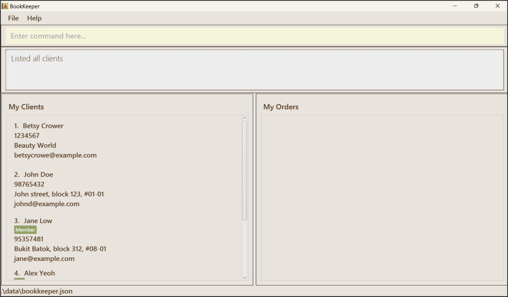

AddressBook Level 3 (AB3) is a **desktop app for managing contacts, optimized for use via a Command Line Interface** (
CLI) while still having the benefits of a Graphical User Interface (GUI). If you can type fast, AB3 can get your contact
management tasks done faster than traditional GUI apps.

* Table of Contents
  {:toc}

--------------------------------------------------------------------------------------------------------------------

## 1. Purpose of User Guide (UG)

--------------------------------------------------------------------------------------------------------------------

## 2. Introduction

### 2.1. Introducing BookKeeper

BookKeeper is an application designed to simplify your client and order management.

With BookKeeper, you can effortlessly organise your client information, track orders and identify loyal customers.
With our innovative mix of a Command Line Interface (CLI) and a Graphical User Interface (GUI), enhance your
productivity while easily tracking.

This user guide is your comprehensive resource for understanding the full capabilities of BookKeeper.
Here, we break down the installation process, system setup, and key features, ensuring seamless adoption and utilisation
of our app. If you are just starting your small florist business, BookKeeper is here to help you efficiently organise
your business operations.

### 2.2. What's New in BookKeeper release v1.4

BookKeeper v1.4 contains the following new features and improvements.

* Order management enhancements
    * Improved functionalities for efficient order management, with features like add, delete, edit and filter orders.

* Links Client to Orders
    * Seamlessly links clients to their respective orders for comprehensive tracking and management
* Provides bug fixes
    * Fixed minor bugs to ensure the smooth operation of the application

### 2.3. Product Description

BookKeeper is like an address book, providing a working platform that can effectively manage user information
and orders. This efficiently manages customer relationships as it maximises user productivity.

### 2.4. Unique Selling Points

#### 2.4.1. Centralised Platform

BookKeeper offers a centralised platform where you can effortlessly store and search for client information,
keeping all your vital data organised and accessible at your fingertips.

#### 2.4.2. Efficiency

With its intuitive command-line interface, BookKeeper is faster and more efficient than traditional methods
like CRMs or Excel sheets. Spend less time navigating complex menus and more time serving your customer’s needs.

#### 2.4.3. Tailored for Florist Businesses

We understand the unique needs of florists, which is why BookKeeper comes equipped with customizable fields, tags,
and seamless integration with e-commerce platforms.

### 2.4.4. Cost-Effective

Designed with small businesses in mind, BookKeeper is not only powerful but also cost-effective.
Say goodbye to expensive software solutions that drain your resources.
--------------------------------------------------------------------------------------------------------------------

## 3. Target Audience with assumptions

### 3.1. Target Audience

BookKeeper is specifically designed for small florist businesses, catering to the unique needs and challenges they face
in managing client relationships and orders. Our target audience includes small florist shops, independent floral
designers, and boutique flower businesses.

### 3.2. Assumptions

1. Our application is made with the assumption that users are members of the florist industry and will understand the
   needs as well as the terminology used by florists. They can either be business owners, managers, or employees and
   are looking for a tailored solution to streamline their operations.
2. Users are presumed to have a basic understanding of computer operations and software usage. This can help them to
   navigate easily through the application and follow the instructions to download and use BookKeeper,
   as provided in this guide.
3. While prior experience with customer relationship management (CRM) systems and command line interfaces (CLIs) can
   help users to familiarise themselves with BookKeeper fast, BookKeeper is also entry-level-friendly so that we can
   accommodate users of all levels of technical expertise.

--------------------------------------------------------------------------------------------------------------------

## 4. Quick start

1. Ensure you have Java `11` or above installed in your Computer.

1. Download the latest `addressbook.jar` from [here](https://github.com/AY2324S2-CS2103T-T09-2/tp/releases).

1. Copy the file to the folder you want to use as the _home folder_ for your AddressBook.

1. Open a command terminal, `cd` into the folder you put the jar file in, and use the `java -jar addressbook.jar`
   command to run the application. 
   A GUI similar to the below should appear in a few seconds. Note how the app contains some sample data. 
   

1. Type the command in the command box and press Enter to execute it. e.g. typing **`help`** and pressing Enter will
   open the help window. 
   Some example commands you can try:

    * `list` : Lists all contacts.

    * `add n/John Doe p/98765432 e/johnd@example.com a/John street, block 123, #01-01` : Adds a contact named `John Doe`
      to the Address Book.

    * `delete 3` : Deletes the 3rd contact shown in the current list.

    * `clear` : Deletes all contacts.

    * `exit` : Exits the app.

1. Refer to the [Features](#features) below for details of each command.

--------------------------------------------------------------------------------------------------------------------

## 5. Commands

### 5.1 Command summary
### 5.1.1 Client

|  Action    | Format, Examples                                                                                                                                                      |
|------------|-----------------------------------------------------------------------------------------------------------------------------------------------------------------------|
| **Add**    | `add n/NAME p/PHONE_NUMBER e/EMAIL a/ADDRESS [t/TAG]…​`   e.g., `add n/James Ho p/22224444 e/jamesho@example.com a/123, Clementi Rd, 1234665 t/friend t/colleague` |
| **Clear**  | `clear`                                                                                                                                                               |
| **Delete** | `delete INDEX`  e.g., `delete 3`                                                                                                                                   |
| **Edit**   | `edit INDEX [n/NAME] [p/PHONE_NUMBER] [e/EMAIL] [a/ADDRESS] [t/TAG]…​`  e.g.,`edit 2 n/James Lee e/jameslee@example.com`                                           |
| **Find**   | `find KEYWORD [MORE_KEYWORDS]`  e.g., `find James Jake`                                                                                                            |
| **List**   | `list`                                                                                                                                                                |
| **Help**   | `help`                                                                                                                                                                |

### 5.1.2 Order

| Action          | Format, Examples                                                                                          |
|-----------------|-----------------------------------------------------------------------------------------------------------|
| **addOrder**    | `addOrder INDEX d/DESCRIPTION b/by p/PRICE`   e.g., `addOrder 3 d/1xRoses b/23-07-2024 00:00 p/123.99` |
| **deleteOrder** | `deleteOrder INDEX`   `deleteOrder 3`                                                                 |
| **editOrder**   | `editOrder d/DESCRIPTION b/by p/PRICE`                                                                    |

--------------------------------------------------------------------------------------------------------------------

## 6. Main Features

**:information_source: Notes about the command format:** 

* Words in `UPPER_CASE` are the parameters to be supplied by the user. 
  e.g. in `add n/NAME`, `NAME` is a parameter which can be used as `add n/John Doe`.

* Items in square brackets are optional. 
  e.g `n/NAME [t/TAG]` can be used as `n/John Doe t/friend` or as `n/John Doe`.

* Items with `…`​ after them can be used multiple times including zero times. 
  e.g. `[t/TAG]…​` can be used as ` ` (i.e. 0 times), `t/friend`, `t/friend t/family` etc.

* Parameters can be in any order. 
  e.g. if the command specifies `n/NAME p/PHONE_NUMBER`, `p/PHONE_NUMBER n/NAME` is also acceptable.

* Extraneous parameters for commands that do not take in parameters (such as `help`, `list`, `exit` and `clear`) will be
  ignored. 
  e.g. if the command specifies `help 123`, it will be interpreted as `help`.

* If you are using a PDF version of this document, be careful when copying and pasting commands that span multiple lines
  as space characters surrounding line-breaks may be omitted when copied over to the application.

### Viewing help : `help`

Shows a message explaning how to access the help page.

Format: `help`

### Clearing all entries : `clear`

Clears all entries from the address book.

Format: `clear`

### <ins>Client Features:

### Adding a person: `add`

Adds a person to the address book.

Format: `add n/NAME p/PHONE_NUMBER e/EMAIL a/ADDRESS [t/TAG]…​`

:bulb: **Tip:**
A person can have any number of tags (including 0)

Examples:

* `add n/John Doe p/98765432 e/johnd@example.com a/John street, block 123, #01-01`
* `add n/Betsy Crowe t/friend e/betsycrowe@example.com a/Newgate Prison p/1234567 t/criminal`

### Editing a person : `edit`

Edits an existing person in the address book.

Format: `edit INDEX [n/NAME] [p/PHONE] [e/EMAIL] [a/ADDRESS] [t/TAG]…​`

* Edits the person at the specified `INDEX`. The index refers to the index number shown in the displayed person list.
  The index **must be a positive integer** 1, 2, 3, …​
* At least one of the optional fields must be provided.
* Existing values will be updated to the input values.
* When editing tags, the existing tags of the person will be removed i.e adding of tags is not cumulative.
* You can remove all the person’s tags by typing `t/` without
  specifying any tags after it.

Examples:

* `edit 1 p/91234567 e/johndoe@example.com` Edits the phone number and email address of the 1st person to be `91234567`
  and `johndoe@example.com` respectively.
* `edit 2 n/Betsy Crower t/` Edits the name of the 2nd person to be `Betsy Crower` and clears all existing tags.

### Deleting a person : `delete`

Deletes the specified person from the address book.

Format: `delete INDEX`

* Deletes the person at the specified `INDEX`.
* The index refers to the index number shown in the displayed person list.
* The index **must be a positive integer** 1, 2, 3, …​

Examples:

* `list` followed by `delete 2` deletes the 2nd person in the address book.
* `find Betsy` followed by `delete 1` deletes the 1st person in the results of the `find` command.

### Listing all persons : `list`

Shows a list of all persons in the address book.

Format: `list`

### Locating persons by name: `find`

Finds persons whose names contain any of the given keywords.

Format: `find KEYWORD [MORE_KEYWORDS]`

* The search is case-insensitive. e.g `hans` will match `Hans`
* The order of the keywords does not matter. e.g. `Hans Bo` will match `Bo Hans`
* Only the name is searched.
* Only full words will be matched e.g. `Han` will not match `Hans`
* Persons matching at least one keyword will be returned (i.e. `OR` search).
  e.g. `Hans Bo` will return `Hans Gruber`, `Bo Yang`

Examples:

* `find John` returns `john` and `John Doe`
* `find alex david` returns `Alex Yeoh`, `David Li` 
  

### Exiting the program : `exit`

Exits the program.

Format: `exit`

### <ins>Order Features:

### Adding an order: `addOrder`
Adds an order into BookKeeper.

Format: `addOrder INDEX d/DESCRIPTION b/by p/PRICE`

* Adds the order to the user at the specified `INDEX`.
  The index **must be a positive integer** 1, 2, 3, …​
* All fields must be provided.

Examples:
* order 1 d/1xRoses c/40 by/23-07-2024 00:00

### Deleting an order: `deleteOrder`
Deletes the specified order from BookKeeper.

Format: `deleteOrder INDEX`

* Deletes the order at the specified `INDEX`.
* The index refers to the index number shown in the displayed order list.
* The index **must be a positive integer** 1, 2, 3, …​

Examples:

* `deleteOrder 2` deletes the 2nd order in the order list.

### Editing an order : `editOrder`

Edits an existing order in BookKeeper.

Format: `edit <INDEX> [by/ DEADLINE] [c/PRICE] [d/DESCRIPTION] [s/STATUS]`

* Edits the order at the specified `INDEX`.
  The index **must be a positive integer** 1, 2, 3, …​
* At least one of the optional fields must be provided.
* Existing values will be updated to the input values.

Examples:

* `editOrder 1  by/ 23-07-2024 10:10 c/ 40 d/ 1xRoses s/ PENDING` Edits 1st order in the order list.

### Saving the data

AddressBook data are saved in the hard disk automatically after any command that changes the data. There is no need to
save manually.

### Editing the data file

AddressBook data are saved automatically as a JSON file `[JAR file location]/data/addressbook.json`. Advanced users are
welcome to update data directly by editing that data file.

:exclamation: **Caution:**
If your changes to the data file makes its format invalid, AddressBook will discard all data and start with an empty data file at the next run. Hence, it is recommended to take a backup of the file before editing it. 
Furthermore, certain edits can cause the AddressBook to behave in unexpected ways (e.g., if a value entered is outside of the acceptable range). Therefore, edit the data file only if you are confident that you can update it correctly.

### Archiving data files `[coming in v2.0]`

_Details coming soon ..._

--------------------------------------------------------------------------------------------------------------------

## 7. Information about how to use the guide

(insert video here)

(What do the colours mean)

### 7.1. Appendix A: Technical Glossary

**Java** - the programming language that the application was written in,
as well as the process in which the application is run

**Runtime** - a software that users must download onto their systems to run other applications.
The Java runtime allows users to run the BookKeeper application

**JSON (Javascript Object Notation)** - a file format used to store data which is understandable
for both end users and computers. BookKeeper stores its data inside addressbook.json.

**Command Line Interface (CLI)**

A user interface that allows users to interact with the computer software by typing commands into the console.
The CLI is one method which the BookKeeper application can be launched

**CRM (Customer Relationship Management)** - a program that simplifies managing of clientele and their needs.

**GUI (Graphical User Interface)** -

**Terminal Emulator**
An application that is used to run Command Line Interface (CLI) programs for Windows: open Command Prompt or Powershell.
For Mac, open Terminal. For Linux, open your terminal emulator of choice

### 7.2. Appendix B: One page cheatsheet

### 7.3. Appendix C: FAQ

**Q**: I cannot run the application 
**A**: Try updating your system. On Windows, look for Windows Update.
For Mac
For Linux, type in your terminal sudo apt update -y && sudo apt upgrade

**Q**: What command do I use to [...] 
**A**: You can access the help page by clicking the Help button on the page

**Q**: How do I backup and restore data? 
**A**: Your data is stored in the same directory you downloaded the application in.
In that directory, search for a directory called data. In that directory, it is called `addressbook.json`.
You may copy the addressbook.json to another location to back it up,
and you may copy another addressbook.json to restore existing data.

**Q**: Can I access the application from multiple devices at once? 
**A**: Not at the moment. It is something that we are working on, though.

**Q**: Can I access this application without internet connection? 
**A**: BookKeeper is designed to work fully offline

**Q**: The application is not working!!! 
**A**: Contact us at https://github.com/AY2324S2-CS2103T-T09-2/tp/releases

**Q**: How do I update my application? 
**A**: You may download the latest release at https://github.com/AY2324S2-CS2103T-T09-2/tp/releases

--------------------------------------------------------------------------------------------------------------------

## 8. Known issues

1. **When using multiple screens**, if you move the application to a secondary screen, and later switch to using only
   the primary screen, the GUI will open off-screen. The remedy is to delete the `preferences.json` file created by the
   application before running the application again.

--------------------------------------------------------------------------------------------------------------------

