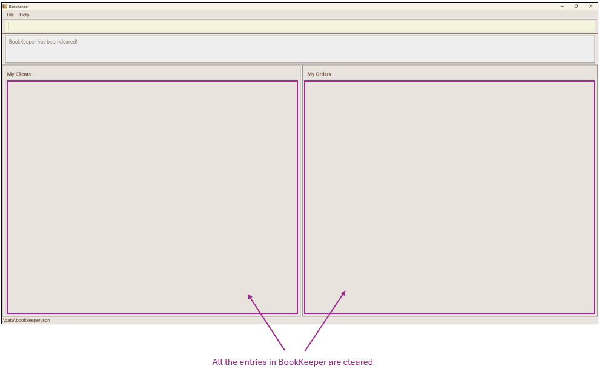
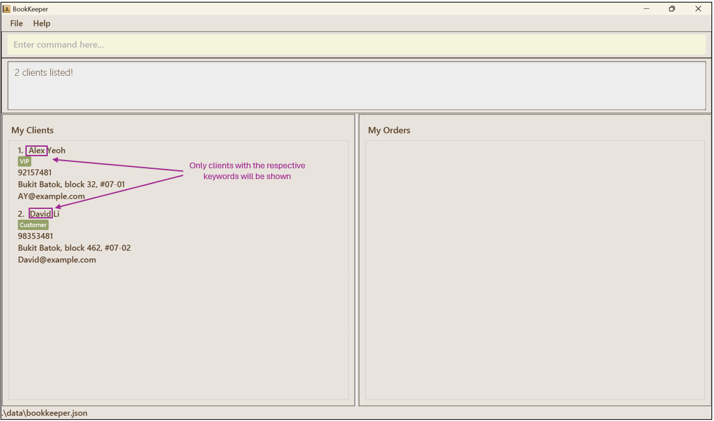
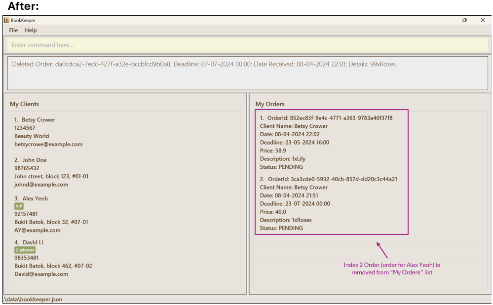

## Table of Contents

[1. Purpose of User Guide (UG)](#1-purpose-of-user-guide-ug)

[2. Introduction](#2-introduction)

* [2.1. Introducing BookKeeper](#21-introducing-bookkeeper)
* [2.2. What's New in BookKeeper release v1.4](#22-whats-new-in-bookkeeper-release-v14)
* [2.3. Product Description](#23-product-description)
* [2.4. Unique Selling Points](#24-unique-selling-points)
    * [2.4.1. Centralised Platform](#241-centralised-platform)
    * [2.4.2. Efficiency](#242-efficiency)
    * [2.4.3. Tailored for Florist Businesses](#243-tailored-for-florist-businesses)
    * [2.4.4. Cost-Effective](#244-cost-effective)

[3. Target Audience with assumptions](#3-target-audience-with-assumptions)

* [3.1. Target Audience](#31-target-audience)
* [3.2. Assumptions](#32-assumptions)

[4. Quick start](#4-quick-start)

[5. Commands](#5-commands)

* [5.1 Command summary](#51-command-summary)
    * [5.1.1 Client](#511-client)
    * [5.1.2 Order](#512-order)

[6. Main Features](#6-main-features)

* [6.1. Help](#61-viewing-help--help)
* [6.2. Clear all entries](#62-clearing-all-entries--clear)
* [6.3. Exit the program](#63-exiting-the-program--exit)
* [6.4. Add a client](#64-adding-a-client-add)
* [6.5. Edit a client](#65-editing-a-client--edit)
* [6.6. Delete a client](#66-deleting-a-client--delete)
* [6.7. List all clients](#67-listing-all-clients--list)
* [6.8. Find clients by name](#68-locating-clients-by-name-find)
* [6.9. Add an order](#69-adding-an-order-order)
* [6.10. Delete an order](#610-deleting-an-order-deleteorder)
* [6.11. Edit an order](#611-editing-an-order--editorder)

[7. Information about how to use the guide](#7-information-about-how-to-use-the-guide)

* [7.1. Appendix A: Technical Glossary](#71-appendix-a-technical-glossary)
* [7.2. Appendix B: One page cheatsheet](#72-appendix-b-one-page-cheatsheet)
* [7.3. Appendix C: FAQ](#73-appendix-c-faq)

[8. Known issues](#8-known-issues)

--------------------------------------------------------------------------------------------------------------------

## 1. Purpose of User Guide (UG)

BookKeeper is a desktop app designed for florists, in particular to manage their clients and orders when selling
flower bouquets.

Our User Guide (UG) provides florists with a comprehensive resource to understand and use BookKeeper effectively.
Inside, we have outlined clear instructions, explanations, and best practices in order to aid florists in navigating
BookKeeper’s features seamlessly. This UG is crucial to help florists comprehend the application’s functionalities,
optimise their workflows, and maximise productivity with ease.

BookKeeper is also optimised for use via a Command Line Interface (
CLI) while still having the benefits of a Graphical User Interface (GUI). If you can type fast, BookKeeper can get your
client management tasks done faster than traditional GUI apps.
--------------------------------------------------------------------------------------------------------------------

## 2. Introduction

### 2.1. Introducing BookKeeper

BookKeeper is an application designed to simplify your client and order management.  
With BookKeeper, you can effortlessly organise your client information, track orders and identify loyal customers. 
This user guide is your comprehensive resource for understanding the full capabilities of BookKeeper.
Here, we break down the installation process, system setup, and key features, ensuring seamless adoption and utilisation
of our app. If you are just starting your small florist business, BookKeeper is here to help you efficiently organise
your business operations.

### 2.2. What's New in BookKeeper release v1.4

BookKeeper v1.4 contains the following new features and improvements.

* Order management enhancements
    * Improved functionalities for efficient order management, with features like add, delete, edit and filter orders.
* Links Client to Orders
    * Seamlessly links clients to their respective orders for comprehensive tracking and management
* Provides bug fixes
    * Fixed minor bugs to ensure the smooth operation of the application

### 2.3. Product Description

BookKeeper is like an address book, providing a working platform that can effectively manage user information
and orders. This efficiently manages customer relationships as it maximises user productivity.

### 2.4. Unique Selling Points

#### 2.4.1. Centralised Platform

BookKeeper offers a centralised platform where you can effortlessly store and search for client information,
keeping all your vital data organised and accessible at your fingertips.

#### 2.4.2. Efficiency

With its intuitive command-line interface, BookKeeper is faster and more efficient than traditional methods
like CRMs or Excel sheets. Spend less time navigating complex menus and more time serving your customer’s needs.

#### 2.4.3. Tailored for Florist Businesses

We understand the unique needs of florists, which is why BookKeeper comes equipped with customizable fields, tags,
and seamless integration with e-commerce platforms.

#### 2.4.4. Cost-Effective

Designed with small businesses in mind, BookKeeper is not only powerful but also cost-effective.
Say goodbye to expensive software solutions that drain your resources.
--------------------------------------------------------------------------------------------------------------------

## 3. Target Audience with assumptions

### 3.1. Target Audience

BookKeeper is specifically designed for small florist businesses, catering to the unique needs and challenges they face
in managing client relationships and orders. Our target audience includes small florist shops, independent floral
designers, and boutique flower businesses.

### 3.2. Assumptions

1. Our application is made with the assumption that users are members of the florist industry and will understand the
   needs as well as the terminology used by florists. They can either be business owners, managers, or employees and
   are looking for a tailored solution to streamline their operations.
2. Users are presumed to have a basic understanding of computer operations and software usage. This can help them to
   navigate easily through the application and follow the instructions to download and use BookKeeper,
   as provided in this guide.
3. While prior experience with customer relationship management (CRM) systems and command line interfaces (CLIs) can
   help users to familiarise themselves with BookKeeper fast, BookKeeper is also entry-level-friendly so that we can
   accommodate users of all levels of technical expertise.

--------------------------------------------------------------------------------------------------------------------

## 4. Quick start

1. Ensure you have Java `11` and above installed in your system.
   * You may check if you have Java installed by opening your command prompt or terminal, and type:  
   `java --version`
     * If Java is installed, you should ensure that it is currently running on version "11.x.xx".
     * 
       * If you encounter an error, or if your version does not match our specified requirements, you may visit the 
       [Official Oracle website](https://www.oracle.com/java/technologies/javase/jdk11-archive-downloads.html) to 
       download the Java JDK required to run this project.

2. Download the latest `bookkeeper.jar` release from [here](https://github.com/AY2324S2-CS2103T-T09-2/tp/releases).

3. Copy the file to the folder you want to use as the _home folder_ for your BookKeeper.

4. Open your terminal or command prompt in your system.

5. `cd` into the folder you put the jar file in, and use the `java -jar bookkeeper.jar`
   command to run the application. 
   A GUI similar to the below should appear in a few seconds. Note how the app contains some sample data. 
   

6. Type the command in the command box and press Enter to execute it. e.g. typing **`help`** and pressing Enter will
   open the help window.  
   Some example commands you can try:
    * Listing all contacts:
      * Command: `list`
    * Adding a new Client:
      * Command `add n/John Doe p/98765432 e/johnd@example.com a/John street, block 123, #01-01`
      * Adds a new `client` named `John Doe` to BookKeeper.
    * Adding a new Order:
      * Command `order 1 d/1xRoses c/20.99 by/20-10-2030 10:00`
      * Adds a new `order` for 1 Rose, at $20.99 that is to be delivered by 20-10-2030 10:00.
    * Delete an existing Client.
      * Command `delete 1`
      * Deletes the `client` with an index of 1.
    * Clear BookKeeper
      * Command `clear`
      * Clears all clients and orders.
    * Exit
      * Command `exit`
      * Closes the application.

7. Refer to the [Main Features](#6-main-features) below for details of each command.

--------------------------------------------------------------------------------------------------------------------

## 5. Commands

### 5.1 Command summary

### 5.1.1 Client

| Action     | Format, Examples                                                                                                                                                      |
|------------|-----------------------------------------------------------------------------------------------------------------------------------------------------------------------|
| **Add**    | `add n/NAME p/PHONE_NUMBER e/EMAIL a/ADDRESS [t/TAG]…​`   e.g., `add n/James Ho p/22224444 e/jamesho@example.com a/123, Clementi Rd, 1234665 t/friend t/colleague` |
| **Clear**  | `clear`                                                                                                                                                               |
| **Delete** | `delete INDEX`  e.g., `delete 3`                                                                                                                                   |
| **Edit**   | `edit INDEX [n/NAME] [p/PHONE_NUMBER] [e/EMAIL] [a/ADDRESS] [t/TAG]…​`  e.g.,`edit 2 n/James Lee e/jameslee@example.com`                                           |
| **Find**   | `find KEYWORD [MORE_KEYWORDS]`  e.g., `find James Jake`                                                                                                            |
| **List**   | `list`                                                                                                                                                                |
| **Help**   | `help`                                                                                                                                                                |

### 5.1.2 Order

| Action          | Format, Examples                                                                                                                     |
|-----------------|--------------------------------------------------------------------------------------------------------------------------------------|
| **order**       | `order INDEX by/DEADLINE c/PRICE d/DESCRIPTION`   e.g., `order 3 by/23-07-2024 00:00 c/99.99 d/1xRoses`                           |
| **deleteOrder** | `deleteOrder INDEX`   e.g., `deleteOrder 3`                                                                                      |
| **editOrder**   | `editOrder INDEX by/DEADLINE c/PRICE d/DESCRIPTION s/STATUS`   e.g., `editOrder 1 by/23-07-2024 10:10 c/40 d/1xRoses s/COMPLETED` |

--------------------------------------------------------------------------------------------------------------------

## 6. Main Features

**:information_source: Notes about the command format:** 

* Words in `UPPER_CASE` are the parameters to be supplied by the user. 
  e.g. in `add n/NAME`, `NAME` is a parameter which can be used as `add n/John Doe`.

* Items in square brackets are optional. 
  e.g `n/NAME [t/TAG]` can be used as `n/John Doe t/friend` or as `n/John Doe`.

* Items with `…`​ after them can be used multiple times including zero times. 
  e.g. `[t/TAG]…​` can be used as ` ` (i.e. 0 times), `t/friend`, `t/friend t/family` etc.

* Parameters can be in any order. 
  e.g. if the command specifies `n/NAME p/PHONE_NUMBER`, `p/PHONE_NUMBER n/NAME` is also acceptable.

* Extraneous parameters for commands that do not take in parameters (such as `help`, `list`, `exit` and `clear`) will be
  ignored. 
  e.g. if the command specifies `help 123`, it will be interpreted as `help`.

* If you are using a PDF version of this document, be careful when copying and pasting commands that span multiple lines
  as space characters surrounding line-breaks may be omitted when copied over to the application.

### 6.1. Viewing help : `help`

Shows a message explaning how to access the help page.  
  
Format: `help`

### 6.2. Clearing all entries : `clear`

Clears all entries from BookKeeper.  
Format: `clear`  

### 6.3. Exiting the program : `exit`

Exits the program.  
Format: `exit`

### <ins>Client Features:

### 6.4. Adding a client: `add`

Adds a client to BookKeeper.  
Format: `add n/NAME p/PHONE_NUMBER e/EMAIL a/ADDRESS [t/TAG]…​`

**:information_source: Additional Notes:** 

* A client can have any number of tags (including 0)
* tags do not accept whitespaces (e.g. "VIP 2" is not accepted, "VIP2" is accepted)
* tags only accept 0-9 and a-z (case-insensitive)

Example:
`add n/Betsy Crowe e/betsycrowe@example.com a/Beauty World p/1234567 t/VIP`

More examples:

* `add n/John Doe p/98765432 e/johnd@example.com a/John street, block 123, #01-01`
* `add n/Jane Low p/95357481 e/jane@example.com a/Bukit Batok, block 312, #08-01 t/Member`
* `add n/Alex Yeoh p/92157481 e/AY@example.com a/Bukit Batok, block 32, #07-01 t/VIP`
* `add n/David Li p/98353481 e/David@example.com a/Bukit Batok, block 462, #07-02 t/Customer`

### 6.5. Editing a client : `edit`

Edits an existing client in BookKeeper.  
Format: `edit INDEX [n/NAME] [p/PHONE] [e/EMAIL] [a/ADDRESS] [t/TAG]…​`

**:information_source: Additional Notes:** 

* Edits the client at the specified `INDEX`. The index refers to the index number shown in the displayed client list.
  The index **must be a positive integer** 1, 2, 3, …​
* At least one of the optional fields must be provided.
* Existing values will be updated to the input values.
* When editing tags, the existing tags of the client will be removed i.e adding of tags is not cumulative.
* You can remove all the client’s tags by typing `t/` without
  specifying any tags after it.
* tags do not accept whitespaces (e.g. "VIP 2" is not accepted, "VIP2" is accepted)
* tags only accept 0-9 and a-z (case-insensitive)

Example:
`edit 1 n/Betsy Crower t/` Edits the name of the 1st client to be `Betsy Crower` and clears all existing tags.

More examples:

`edit 2 p/91234567 e/johndoe@example.com` Edits the phone number and email address of the 2nd client to
be `91234567` and `johndoe@example.com` respectively.

### 6.6. Deleting a client : `delete`

Deletes the specified client from BookKeeper.  
Format: `delete INDEX`

**:information_source: Additional Notes:** 

* Deletes the client at the specified `INDEX`.
* The index refers to the index number shown in the displayed client list.
* The index **must be a positive integer** 1, 2, 3, …​

Example:

* `list` followed by `delete 2` deletes the 2nd client in BookKeeper.

More examples:

* `find Betsy` followed by `delete 1` deletes the 1st client in the results of the `find` command.

### 6.7. Listing all clients : `list`

Shows a list of all clients in BookKeeper.  
Format: `list`  

### 6.8. Locating clients by name: `find`

Finds clients whose names contain any of the given keywords.  
Format: `find KEYWORD [MORE_KEYWORDS]`

**:information_source: Additional Notes:** 

* The search is case-insensitive. e.g `hans` will match `Hans`
* The order of the keywords does not matter. e.g. `Hans Bo` will match `Bo Hans`
* Only the name is searched.
* Only full words will be matched e.g. `Han` will not match `Hans`
* Clients matching at least one keyword will be returned (i.e. `OR` search).
  e.g. `Hans Bo` will return `Hans Gruber`, `Bo Yang`

Example:

* `find alex david` returns `Alex Yeoh`, `David Li`

More examples:

* `find John` returns `john` and `John Doe`

### <ins>Order Features:

### 6.9. Adding an order: `order`

Adds an order into BookKeeper.  
Format: `order <INDEX> by/DEADLINE c/PRICE d/DESCRIPTION`

**:information_source: Additional Notes:** 

* Adds the order to the client at the specified `INDEX`.
  The index **must be a positive integer** 1, 2, 3, …​, and the index must exist in the Client list.
* All fields must be provided.
* order of the fields does not matter
  (e.g. both `order <INDEX> by/DEADLINE c/PRICE d/DESCRIPTION` and `order <INDEX> d/DESCRIPTION c/PRICE by/DEADLINE`
  are acceptable)
* All orders status are automatically set to PENDING.
* OrderID is automatically generated for better reference during delivery.
* Please specify `by/DEADLINE` field in `DD-MM-YYYY HH:MM`.
* For the `c/PRICE` field, do note that any decimal places after 2 will be rounded up.
    * For e.g. `2.999` will be rounded up to `3.00`.
* The order list will be sorted according to their deadline. 
  * Meaning, if there are two orders, one due on `10-10-2025 10:00` and another due on `10-10-2025 10:30`, the order with 
  the deadline of `10-10-2025 10:00` will have an index of `1`, and the other order will have an index of `2`. 

Examples:

* `order 1 d/1xRoses c/40 by/23-07-2024 00:00`

More examples:

* `order 3 by/07-07-2024 00:00 c/88.88 d/99xRoses`
* `order 1 by/23-05-2024 16:00 c/58.90 d/1xLily`

### 6.10. Deleting an order: `deleteOrder`

Deletes the specified order from BookKeeper.  
Format: `deleteOrder INDEX`

**:information_source: Additional Notes:** 
Format: `editOrder <INDEX> [by/DEADLINE] [c/PRICE] [d/DESCRIPTION] [s/STATUS]`

**:information_source: Additional Notes:** 
Furthermore, certain edits can cause the BookKeeper to behave in unexpected ways (e.g., if a value entered is outside of the acceptable range). Therefore, edit the data file only if you are confident that you can update it correctly.

### Archiving data files `[coming in v2.0]`

_Details coming soon ..._

--------------------------------------------------------------------------------------------------------------------

## 7. Information about how to use the guide

What do the colours mean?

BookKeeper mainly uses four colours: beige, muted green, creamy yellow, and warm brown.

We hoped to achieve a cohesive colour scheme that not only shows visual hierarchy, but provides florists with a sense
of familiarity by choosing colours that are reminiscent of nature. The neutral colour palette caters to a the wide
diversity of florists, be it with respect to age group or gender, while also ensuring that the app remains timeless
and appealing.

This combination of colours not only enhances the aesthetics of BookKeeper, but also promises a user experience that
is consistently positive and engaging.

### 7.1. Appendix A: Technical Glossary

**Java** - the programming language that the application was written in,
as well as the process in which the application is run

**JSON (Javascript Object Notation)** - a file format used to store data which is understandable
for both end users and computers. BookKeeper stores its data inside bookkeeper.json.

**Command Line Interface (CLI)**

A user interface that allows users to interact with the computer software by typing commands into the console.
The CLI is one method which BookKeeper application can be launched

**CRM (Customer Relationship Management)** - a program that simplifies managing of clientele and their needs.

**GUI (Graphical User Interface)** - is a type of user interface that allows users to interact through buttons and text.

### 7.2. Appendix B: FAQ

**Q**: I cannot run the application. 
**A**: Try updating your system. On Windows, look for Windows Update.
For Linux, type in your terminal `sudo apt update -y && sudo apt upgrade -y`.

**Q**: What command do I use to [...]. 
**A**: You can access the help page by clicking the Help button on the page.

**Q**: How do I back up and restore data? 
**A**: Your data is stored in the same directory you downloaded the application in.
In that directory, search for a directory called data. In that directory, it is called `bookkeeper.json`.
You may copy bookkeeper.json to another location to back it up,
and you may copy another bookkeeper.json to restore existing data.

**Q**: Can I access the application from multiple devices at once? 
**A**: Not at the moment. It is something that we are working on, though.

**Q**: Can I access this application without internet connection? 
**A**: BookKeeper is designed to work fully offline.

**Q**: The application is not working!!! 
**A**: Contact us at [here](https://github.com/AY2324S2-CS2103T-T09-2/tp/releases).

**Q**: How do I update my application? 
**A**: You may download the latest release [here](https://github.com/AY2324S2-CS2103T-T09-2/tp/releases).
--------------------------------------------------------------------------------------------------------------------

## 8. Known issues

1. **When using multiple screens**, if you move the application to a secondary screen, and later switch to using only
   the primary screen, the GUI will open off-screen. The remedy is to delete the `preferences.json` file created by the
   application before running the application again.

--------------------------------------------------------------------------------------------------------------------

